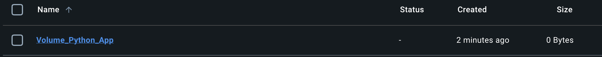
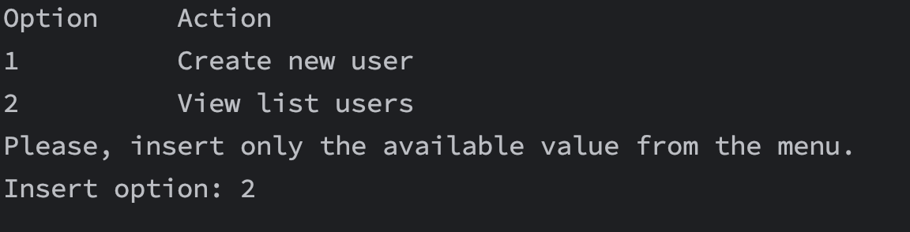

# Python Application Using <ins>**Docker Volumes**</ins>
## Table Of Contents
* [Description](#description)
* [Main Application](#main_app)
  - [Store_Data](#store_data)
  - [View_Data](#view_data)
* [Dockerfile](#dockerfile)
  - [Command Dockerfile](#command_file)
  - [Build Docker Image](#build_image)
  - [Create Docker Volume](#create_volume)
  - [Run Docker Container](#run_container)
* [View Data In The Docker Volume](#view_data_volume)

---
<a name="description"></a> 
## Description
This application allow to user to store into a file saome User's data info, such as Name, Surname, Address and Phone Number and to view the data stored.<br>
The storing of data's are set in a file, and this file, will be stored into a <strong>[Docker Volumes](https://docs.docker.com/engine/storage/volumes)</strong> (<ins>NOT</ins> into some project's folder).<br>
The purpose of this app is to understand how the <em>data persist</em>, even when the container it's restarted or removed; of course the Volume used is a <mark>Persistent Volume</mark>, not a Unknow Volume (temporary volume).<br>
The application works via Terminal bash, not GUI.<br>
Application is write in [Python](https://www.python.org).<br>
The Tree of application is:
- **`Project_Pythony/`**: The root directory of the project.
- **`Main_Code/`**: Contains the main application logic.
- **`Classes/`**: Includes additional modules used by the main application.
- **`View_Users/`**: Manages user view list functionality. 
- **`Store_Data/`**: Handles data storage operations.
- **`Create_Users/`**: Manages user creation functionality.
- **`Dockerfile`**: Defines the Docker container setup for the project.
- **`README.md`**: Documentation for the project.

  
---
<a name="main_app"></a>
## Main Application
The application in the main page, show to user a menu list to create a new user, or view the list of all users.<br>
The input is via Terminal command.
```
menu_app = {
    "1": "Create new user",
    "2": "View list users"
}
```
As you can see, it was used a dictionary to use the pair <ins><em>Key: Values</em></ins> to bind the option with the action.<br>
It be used a match statesman to call the proper function based on user's choice:
```
# Call the property function based on the user's chosen option.
match option_chosen:
  case "1":
    Create_Users.Create_users.new_user()
  case "2":
    View_Users.View_users.list_users_volume()
  case _:
    return 0
```

<a name="store_data"></a>
### Store_Data
This function is structured for storing the data of new users into the file in the <mark>Docker Volume Directory</mark>.<br>
Initally it created the path of Docker Volume where the data will be stored (the path is harded code inside the code).
```
# This is the PATH inside the Docker Container Volume
path_volume_docker = "/Docker_Directory/Storage/User_Data.txt"

# Check if the directory inside the volume exist or not.
# In case it doesn't exist, it is created.
directory = os.path.dirname(path_volume_docker)
if not os.path.exists(directory):
    os.makedirs(directory)
    print(f"Created directory: {directory}")
```
The "<ins> /Docker_Directory/Storage/User_Data.txt< /ins>" will be the path inside the Docker Volume where the file "User_Data.txt" will store data.

<a name="view_data"></a>
### View_Data
This function is used to view all the users are stored inside the Docker Volume file (/Docker_Directory/Storage/User_Data.txt).<br>
It be defined the path of Docker Volume where the data has been stored (the path is harded code inside the code).

```
# This is the PATH inside the Docker Container Volume
path_volume_docker = "/Docker_Directory/Storage/User_Data.txt"

# Check if the directory inside the volume exist or not.
directory = os.path.dirname(path_volume_docker)
if not os.path.exists(directory):
    print(f"The directory {directory} was not found")
```

---
<a name="dockerfile"></a>
## Dockerfile
This file contain all commands used to build the Image that Containers will use.<br>
The Image is a snapshot of the source code, and when it did build, the Image is in read-only mode, and you cannot change the code. If you want to create a container based to the new image, you must re-build the image.

--
<a name="command_file"></a>
### Command Dockerfile
The commands used to build the image that it'll be used to create the container that has the code, you must declare some parameters.<br>
In this image it used the following commands:
- FROM
- LABEL
- WORKDIR
- COPY
- ENV
- RUN
- CMD

The <strong> FROM </strong> command it used to pull all dependenties based on the image that we pass as a parameter.<br>
In this case, we defined an image for a Python application, therefore with this command, we pull oll the dependenties from the <ins>official</ins> [Python Image](https://hub.docker.com/_/python), stored in the [Docker Hub](https://hub.docker.com).
```
FROM python:latest
```
The word "<b> latest </b>" define to use the latest versione of the image we want to pull.
<br>

The <strong> WORKDIR </strong> command it used to define our work directory that all the <mark> next following command in the Dockerfile </strong> will be executed.<br>
```
WORKDIR /Docker_Directory
```

The <strong> COPY </strong> command it used to say to Docker, that it must copy all the file stored in the same directory of Dockerfile, to some directory in the container (that we pecified).
```
COPY . .
```
<br>

The <strong> ENV </strong> command it used to set the wanted variable to be include the wanted directory.
```
# Set the PYTHONPATH to include the "Docker_Directory" directory
ENV PYTHONPATH "${PYTHONPATH}:/Docker_Directory"
```
<br>

The <strong> RUN </strong> command it used to run a specific command in the Container filesystem.
```
# Ensure the storage directory exists
RUN mkdir -p /Docker_Directory/Storage
```
<br>

The <strong> CMD </strong> command it used to say to Docker to run the command we specified in the dockerfile.
```
CMD ["python", "./Main_Code/main.py"]
```

--
<a name="build_image"></a>
### Build Docker Image
To build image, you must use the <strong> BUILD </strong> command, and pass where the dockerfile is stored, as a parameter.<br>
It be the result.<br>
```
# If you ware in the same directory (as path) of where Dockerfile is stored, you can pass it as " . " argument.
docker build -t python_app_image:1 .
```

<br>
To view the image was builted, you can view with the following command:
```
docker image ls
```

or via Docker Desktop app:


--
<a name="create_volume"></a>
### Create The Docker Volume
After you successfully build the Image, you can create the Docker Volume that it will be used to store data.<br>
To create the <mark>Persisten Volume</mark>, you must use the following command:
```
docker volume Volume_Python_App
```

To view the Volume created, you can see it with the:
```
docker volume ls
```


or via Docker Desktop app:

<br>

--
<a name="run_container"></a>
### Run Docker Container
After you successfully build the Image and created the Docker Volume, you can create and run the Container will contain the python app.<br>
To crate the container, you must use the following command:
```
docker run --name container_python_app  -ti --rm -v Volume_Python_App:/Docker_Directory/Storage python_app_image:1
```
- --name: specify the Container name.
- -ti: specify the Container will be in <em>interactive</em> mode.
- -rm; specify that the Container will be automatically removed whene the execution of the application will terminate.
- -v Volume_Python_App:/Docker_Directory/Storage: specify to mount the Volume with name Volume_Python_App, in the /Docker_Directory/Storage (this path is used to store data).
- python_app_image:1: specify the name of Image that will be used to create the Container.

When you create the container, the app start immediatly, 'cause, in the Dockerfile we declared a CMD command the run the "main.py" file.<br>

If you wanna see the list of container created, you must use the following command:
```
docker ps
```
If you wanna see the list of container that no longer used, for example, such as it was terminated 'cause the app in the container finished the work.<br>
You must use the following command:
```
docker ps -a
```

---
<a name="view_data_volume"></a>
## View Data In The Docker Volume
To view the data after it be stored in the Volume, you can view with 2 mode:
- Using a function of the application (if specified)
- Using Docker Desktop app

With the function of app:



With the Docker Desktop app:


---
## Author
- <ins><b>Nicola Ricciardi</b></ins>
